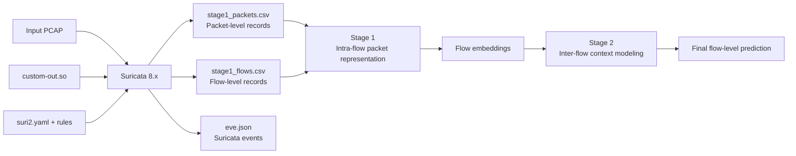

# NIDS-transformer

A network intrusion detection research project based on a custom Suricata output plugin and a hierarchical Transformer architecture.

> Hierarchical Transformer for Network Intrusion Detection Systems (NIDS).

This project consists of two main components:

1. A custom Suricata plugin that reads PCAP files offline and generates aligned packet-level and flow-level CSV files during the same replay;
2. A two-stage hierarchical detection model: Stage 1 learns packet sequences within individual flows, while Stage 2 models the context across multiple flows.

This document focuses on the most stable and reproducible workflow currently available:

```text
Compile the custom plugin -> Validate the Suricata configuration -> Remove or archive old output
                          -> Replay the PCAP offline -> Validate the packet/flow CSV files
```

> [!IMPORTANT]
> The current C plugin opens the CSV files in append mode. If old files are not archived or removed before a new run, the new data will be appended to the existing data, resulting in duplicate samples and contaminated experiments.

## 1. Project Workflow



### What Are Packets and Flows?

- **Packet**: The basic unit of data transmitted over a network. A packet typically contains information such as a timestamp, source and destination IP addresses, source and destination ports, protocol, direction, length, and TCP flags.
- **Flow**: A group of packets belonging to the same communication session. A flow is commonly identified by a five-tuple: `source IP, destination IP, source port, destination port, and transport-layer protocol`. This project records bidirectional statistics, so forward and backward packets from the same session are aggregated into one flow.

The plugin updates the flow statistics whenever it processes a packet and writes one row of flow-level features when the flow ends. This allows the packet CSV and flow CSV to be linked through `flow_id`.

## 2. Repository Structure

```text
NIDS-transformer/
├── README.md
├── requirements.txt
├── suricata-plugin/
│   ├── custom-out.c       # Custom packet/flow CSV output plugin
│   └── suri2.yaml         # Example Suricata configuration
├── s1/
│   ├── stage1/            # Stage 1: intra-flow packet sequence modeling
│   └── run_stage1.py
└── s2/
    ├── stage2/            # Stage 2: inter-flow context modeling
    └── run_stage2.py
```

The plugin build directory on the server is:

```text
/home/xxiong/my_plugin
```

This directory must contain the `Makefile`, `custom-out.c`, and any related build files required by the current Suricata build environment. The plugin source code in this repository is located at `suricata-plugin/custom-out.c`. After updating the source code, synchronize it with the server build directory and recompile the plugin.

## 3. Current Path Configuration

The following paths are used by the example commands in this document. If the project is moved to another machine, update all relevant paths accordingly.

| Purpose | Current path |
|---|---|
| Plugin build directory | `/home/xxiong/my_plugin` |
| Compiled plugin | `/home/xxiong/my_plugin/custom-out.so` |
| Plugin source in the repository | `suricata-plugin/custom-out.c` |
| Suricata configuration | `/home/xxiong/oisf/suricata/suri2.yaml` |
| Input PCAP | `/home/xxiong/pcaps/pbx23_20260512_001.pcap` |
| Packet CSV | `/home/xxiong/pcaps/stage1_packets.csv` |
| Flow CSV | `/home/xxiong/pcaps/stage1_flows.csv` |
| Suricata EVE log | `/var/log/suricata/eve.json` |

The two CSV output paths are currently hard-coded in the plugin source code:

```c
#define CUSTOM_PACKET_CSV_FILE "/home/xxiong/pcaps/stage1_packets.csv"
#define CUSTOM_FLOW_CSV_FILE   "/home/xxiong/pcaps/stage1_flows.csv"
```

If either path is changed, the plugin must be recompiled. Make sure that the new destination directory exists and that the user running Suricata has permission to write to it.

## 4. Compiling the Custom Suricata Plugin

Enter the plugin build directory:

```bash
cd /home/xxiong/my_plugin
```

It is recommended to remove old build artifacts before recompiling:

```bash
make clean
make
```

The same steps can be written as a single command:

```bash
make clean && make
```

Verify that the shared library has been generated:

```bash
ls -lh /home/xxiong/my_plugin/custom-out.so
file /home/xxiong/my_plugin/custom-out.so
```

### What Do `make` and `make clean` Do?

| Command | Purpose | Recommended use |
|---|---|---|
| `make` | Compiles the C source code and generates `custom-out.so` | During the first build or after modifying the source code |
| `make clean` | Removes old object files and shared libraries | Before rebuilding the plugin |

> [!WARNING]
> Do not normally run `make clean` immediately after `make`, because it may delete the newly generated `custom-out.so`. The correct order is generally `make clean` followed by `make`.

The plugin should be recompiled in any of the following situations:

- `custom-out.c` has been modified;
- The CSV fields or output paths have been changed;
- Suricata has been updated or rebuilt;
- The plugin fails to load because of an ABI, symbol, or version incompatibility.

## 5. Configuring Suricata

`suri2.yaml` must load the plugin correctly and enable both custom loggers:

- `custom-packet-logger`: writes data to `stage1_packets.csv`;
- `custom-flow-logger`: writes data to `stage1_flows.csv`.

Confirm the following settings in the configuration file:

1. The plugin path points to `/home/xxiong/my_plugin/custom-out.so`;
2. Both custom loggers are enabled;
3. `HOME_NET` matches the network used in the experiment;
4. The rule, classification, and reference file paths are valid;
5. `/home/xxiong/pcaps` and `/var/log/suricata` exist and are writable;
6. The Suricata major version declared by the configuration is compatible with the installed binary.

Validate the configuration before processing the PCAP:

```bash
sudo suricata -T -c /home/xxiong/oisf/suricata/suri2.yaml
```

Proceed with the offline replay only after the configuration test succeeds. If the test fails, resolve the YAML, rule, plugin path, or dynamic linking errors first.

The plugin dependencies can also be inspected with:

```bash
ldd /home/xxiong/my_plugin/custom-out.so
```

If the output contains `not found`, one or more dynamic libraries required by the plugin cannot be located by the system.

## 6. Handling Existing Output Before a New Run

### 6.1 Inspect Existing Files

```bash
ls -lh /home/xxiong/pcaps
sudo ls -lh /var/log/suricata

ls -lh /home/xxiong/pcaps/stage1_packets.csv
ls -lh /home/xxiong/pcaps/stage1_flows.csv
sudo ls -lh /var/log/suricata/eve.json
```

If a file does not exist, `ls` will report `No such file or directory`. This does not prevent the next run.

### 6.2 Remove Existing Files

If the previous results are no longer required, run:

```bash
sudo rm -f /var/log/suricata/eve.json
sudo rm -f /home/xxiong/pcaps/stage1_flows.csv
sudo rm -f /home/xxiong/pcaps/stage1_packets.csv
```

> [!CAUTION]
> Files removed with `rm -f` cannot normally be recovered. Check every path before running these commands and confirm that the files do not contain results that still need to be preserved. Cleanup must take place before the new extraction run; do not accidentally run these commands after the extraction is complete.

Verify that the files have been removed:

```bash
ls -lh /home/xxiong/pcaps/stage1_packets.csv
ls -lh /home/xxiong/pcaps/stage1_flows.csv
sudo ls -lh /var/log/suricata/eve.json
```

At this point, messages indicating that the files do not exist are expected.

## 7. Reading a PCAP Offline and Generating CSV Files

Confirm that the input PCAP exists:

```bash
ls -lh /home/xxiong/pcaps/pbx23_20260512_001.pcap
```

Start the offline replay:

```bash
sudo suricata \
  -c /home/xxiong/oisf/suricata/suri2.yaml \
  -r /home/xxiong/pcaps/pbx23_20260512_001.pcap
```

Command-line arguments:

| Argument | Description |
|---|---|
| `sudo` | Runs the command with sufficient permission to load the configuration, read the input, and write to the log directory |
| `suricata` | Starts Suricata |
| `-c .../suri2.yaml` | Specifies the configuration file used for this run |
| `-r ...pcap` | Reads the specified PCAP offline instead of monitoring a live network interface |

> [!NOTE]
> Flow-level records are usually written only after a flow ends or the offline replay is complete. Therefore, it is normal for `stage1_flows.csv` to grow more slowly or contain considerably fewer rows than the packet CSV while Suricata is still running.

## 8. Validating the Output

### 8.1 Confirm That the Output Files Were Generated

```bash
ls -lh /home/xxiong/pcaps
sudo ls -lh /var/log/suricata
```

At minimum, the following files are expected:

```text
/home/xxiong/pcaps/stage1_packets.csv
/home/xxiong/pcaps/stage1_flows.csv
/var/log/suricata/eve.json
```
