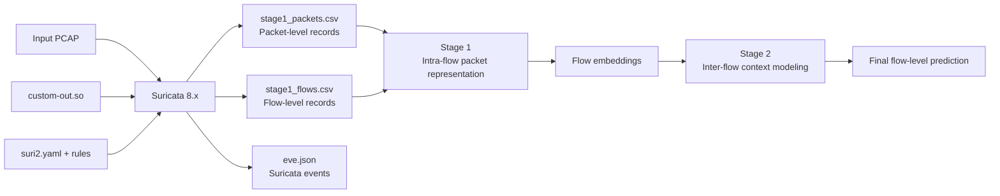

# NIDS-transformer

基于 Suricata 自定义输出插件和分层 Transformer 的网络入侵检测研究项目。

> Hierarchical Transformer for Network Intrusion Detection Systems (NIDS).

本项目包含两个主要部分：

1. 使用自定义 Suricata 插件离线读取 PCAP，在同一次回放中生成相互对齐的 packet-level 和 flow-level CSV；
2. 使用两阶段模型进行分层检测：Stage 1 学习单个 flow 内的 packet 序列，Stage 2 建模多个 flow 之间的上下文。

本文档重点说明目前最稳定、可复现的流程：

```text
编译自定义插件 -> 检查 Suricata 配置 -> 清理或归档旧输出
                -> 离线回放 PCAP -> 验证 packet/flow CSV
```

> [!IMPORTANT]
> 当前 C 插件会以追加模式打开 CSV。如果不先归档或删除旧文件，新一次实验的数据会接在旧数据后面，造成重复样本和实验污染。

## 1. 项目工作流程



### Packet 和 Flow 是什么？

- **Packet（数据包）**：网络传输中的基本数据单元，通常包含时间戳、源/目的 IP、源/目的端口、协议、方向、长度和 TCP flags 等信息。
- **Flow（网络流）**：一组属于同一通信会话的数据包。通常可用五元组标识：`源 IP、目的 IP、源端口、目的端口、传输层协议`。本项目同时记录双向统计，因此会聚合同一会话中的正向和反向 packet。

插件在读取每个 packet 时更新 flow 统计，并在 flow 结束时输出一行 flow-level 特征。这样可以保证 packet CSV 和 flow CSV 通过 `flow_id` 关联。

## 2. 仓库结构

```text
NIDS-transformer/
├── README.md
├── requirements.txt
├── run_stage1.py
├── suricata-plugin/
│   ├── custom-out.c       # 自定义 packet/flow CSV 输出插件
│   └── suri2.yaml         # Suricata 配置示例
├── s1/
│   └── stage1/            # Stage 1：flow 内 packet 序列建模
├── s2/
│   └── stage2/            # Stage 2：flow 间上下文建模
└── doc/                   # 论文、图和实验文档
```

服务器上的插件编译目录为：

```text
/home/xxiong/my_plugin
```

该目录需要包含适用于当前 Suricata 构建环境的 `Makefile`、`custom-out.c` 及相关编译文件。仓库中的插件源代码位于 `suricata-plugin/custom-out.c`；更新源代码后，需要将它同步到服务器编译目录，再重新编译。

## 3. 环境要求

建议使用 Linux 环境。当前配置和插件面向 Suricata 8.x；实际使用时，插件必须由与运行时 Suricata 兼容的头文件和 ABI 编译。

### 3.1 系统工具

- Suricata 8.x；
- GCC 或兼容的 C 编译器；
- GNU Make；
- Suricata 源代码或开发头文件；
- 足够的磁盘空间；
- 对输入 PCAP 的读取权限；
- 对 `/home/xxiong/pcaps` 和 `/var/log/suricata` 的写入权限。

检查工具版本：

```bash
suricata -V
suricata --build-info
make --version
gcc --version
python3 --version
```

> [!NOTE]
> Packet-level CSV 可能非常大，甚至明显大于原始 PCAP。运行大型 PCAP 前，建议先用 `df -h` 检查磁盘空间。

### 3.2 Python 环境（用于后续模型实验）

```bash
cd /path/to/NIDS-transformer

python3 -m venv .venv
source .venv/bin/activate
python3 -m pip install --upgrade pip
python3 -m pip install -r requirements.txt
```

`requirements.txt` 当前包含 NumPy、pandas、scikit-learn、PyTorch、joblib 和 PyYAML。模型训练还需要与具体数据集相匹配的配置、数据划分和实验参数；请为每次训练保存独立的运行清单。

## 4. 当前路径配置

下表对应本文档中的示例命令。迁移到其他机器时，需要同步修改这些路径。

| 用途 | 当前路径 |
|---|---|
| 插件编译目录 | `/home/xxiong/my_plugin` |
| 编译后的插件 | `/home/xxiong/my_plugin/custom-out.so` |
| 仓库内插件源代码 | `suricata-plugin/custom-out.c` |
| Suricata 配置 | `/home/xxiong/oisf/suricata/suri2.yaml` |
| 输入 PCAP | `/home/xxiong/pcaps/pbx23_20260512_001.pcap` |
| Packet CSV | `/home/xxiong/pcaps/stage1_packets.csv` |
| Flow CSV | `/home/xxiong/pcaps/stage1_flows.csv` |
| Suricata EVE 日志 | `/var/log/suricata/eve.json` |

插件源代码中目前硬编码了两个 CSV 输出路径：

```c
#define CUSTOM_PACKET_CSV_FILE "/home/xxiong/pcaps/stage1_packets.csv"
#define CUSTOM_FLOW_CSV_FILE   "/home/xxiong/pcaps/stage1_flows.csv"
```

如果修改这两个路径，必须重新编译插件。还要确保新的目标目录已经创建，并且运行 Suricata 的用户具有写权限。

## 5. 编译自定义 Suricata 插件

进入插件编译目录：

```bash
cd /home/xxiong/my_plugin
```

推荐先清除旧的编译产物，再重新编译：

```bash
make clean
make
```

也可以写成一条命令：

```bash
make clean && make
```

验证共享库是否生成：

```bash
ls -lh /home/xxiong/my_plugin/custom-out.so
file /home/xxiong/my_plugin/custom-out.so
```

### `make` 和 `make clean` 的作用

| 命令 | 作用 | 建议使用时机 |
|---|---|---|
| `make` | 编译 C 源代码并生成 `custom-out.so` | 第一次编译或源代码修改后 |
| `make clean` | 删除旧的目标文件和共享库 | 重新编译之前 |

> [!WARNING]
> 一般不要在 `make` 之后立刻执行 `make clean`，否则可能删除刚生成的 `custom-out.so`。正确顺序通常是 `make clean`，然后 `make`。

以下情况需要重新编译：

- 修改了 `custom-out.c`；
- 修改了 CSV 字段或输出路径；
- 更新或重新编译了 Suricata；
- 插件加载时出现 ABI、符号或版本不兼容错误。

## 6. 配置 Suricata

`suri2.yaml` 必须正确加载插件，并启用两个自定义 logger：

- `custom-packet-logger`：写入 `stage1_packets.csv`；
- `custom-flow-logger`：写入 `stage1_flows.csv`。

配置中需要确认以下内容：

1. 插件路径指向 `/home/xxiong/my_plugin/custom-out.so`；
2. 两个自定义 logger 均已启用；
3. `HOME_NET` 与实验网络一致；
4. rule 文件、classification 文件和 reference 文件路径有效；
5. `/home/xxiong/pcaps` 和 `/var/log/suricata` 存在且可写；
6. 配置声明的 Suricata 主版本与实际二进制兼容。

在正式读取 PCAP 前，先测试配置：

```bash
sudo suricata -T -c /home/xxiong/oisf/suricata/suri2.yaml
```

只有配置测试成功后，才继续运行离线回放。如果测试失败，应先解决 YAML、规则、插件路径或动态链接问题。

可以进一步检查插件依赖：

```bash
ldd /home/xxiong/my_plugin/custom-out.so
```

如果输出包含 `not found`，说明插件依赖的动态库没有被系统找到。

## 7. 运行前处理旧输出

### 7.1 先查看现有文件

```bash
ls -lh /home/xxiong/pcaps
sudo ls -lh /var/log/suricata

ls -lh /home/xxiong/pcaps/stage1_packets.csv
ls -lh /home/xxiong/pcaps/stage1_flows.csv
sudo ls -lh /var/log/suricata/eve.json
```

如果某个文件不存在，`ls` 会提示 `No such file or directory`，这不影响后续运行。

### 7.2 方案 A：归档旧文件（推荐）

归档可以保留上一次实验结果，适合论文实验和可复现性检查：

```bash
RUN_TAG=$(date +%Y%m%d_%H%M%S)
ARCHIVE_DIR=/home/xxiong/pcaps/archive/${RUN_TAG}

sudo mkdir -p "${ARCHIVE_DIR}"

sudo test ! -f /home/xxiong/pcaps/stage1_packets.csv || \
  sudo mv /home/xxiong/pcaps/stage1_packets.csv "${ARCHIVE_DIR}/"

sudo test ! -f /home/xxiong/pcaps/stage1_flows.csv || \
  sudo mv /home/xxiong/pcaps/stage1_flows.csv "${ARCHIVE_DIR}/"

sudo test ! -f /var/log/suricata/eve.json || \
  sudo mv /var/log/suricata/eve.json "${ARCHIVE_DIR}/"

sudo chown -R xxiong:xxiong "${ARCHIVE_DIR}"
ls -lh "${ARCHIVE_DIR}"
```

### 7.3 方案 B：删除旧文件

如果明确不需要旧结果，可以运行：

```bash
sudo rm -f /var/log/suricata/eve.json
sudo rm -f /home/xxiong/pcaps/stage1_flows.csv
sudo rm -f /home/xxiong/pcaps/stage1_packets.csv
```

> [!CAUTION]
> `rm -f` 不可恢复。执行前请再次检查路径，并确认这些文件不是仍需保存的实验结果。清理必须发生在新一轮提取之前；不要在提取完成后误执行这些命令。

删除后验证：

```bash
ls -lh /home/xxiong/pcaps/stage1_packets.csv
ls -lh /home/xxiong/pcaps/stage1_flows.csv
sudo ls -lh /var/log/suricata/eve.json
```

此时看到文件不存在是预期结果。

## 8. 离线读取 PCAP 并生成 CSV

确认输入 PCAP 存在：

```bash
ls -lh /home/xxiong/pcaps/pbx23_20260512_001.pcap
```

执行离线回放：

```bash
sudo suricata \
  -c /home/xxiong/oisf/suricata/suri2.yaml \
  -r /home/xxiong/pcaps/pbx23_20260512_001.pcap
```

原始单行命令与上面的命令等价：

```bash
sudo suricata -c /home/xxiong/oisf/suricata/suri2.yaml -r /home/xxiong/pcaps/pbx23_20260512_001.pcap
```

参数说明：

| 参数 | 含义 |
|---|---|
| `sudo` | 以足够权限加载配置、读取文件并写入日志目录 |
| `suricata` | 启动 Suricata |
| `-c .../suri2.yaml` | 指定本次运行使用的配置文件 |
| `-r ...pcap` | 离线读取指定 PCAP，而不是监听实时网卡 |

Suricata 正常结束后，可以检查上一条命令的退出码：

```bash
echo $?
```

`0` 通常表示进程正常结束；非 `0` 表示需要查看终端输出和日志定位错误。

> [!NOTE]
> Flow-level 记录通常需要等 flow 结束或离线回放完成后才会全部写出。因此，运行过程中 `stage1_flows.csv` 增长较慢或行数明显少于 packet CSV，通常是正常现象。

## 9. 验证输出结果

### 9.1 检查文件是否生成

```bash
ls -lh /home/xxiong/pcaps
sudo ls -lh /var/log/suricata
```

预期至少看到：

```text
/home/xxiong/pcaps/stage1_packets.csv
/home/xxiong/pcaps/stage1_flows.csv
/var/log/suricata/eve.json
```

### 9.2 检查 CSV 的表头和末尾记录

```bash
head -n 2 /home/xxiong/pcaps/stage1_packets.csv
head -n 2 /home/xxiong/pcaps/stage1_flows.csv

tail -n 2 /home/xxiong/pcaps/stage1_packets.csv
tail -n 2 /home/xxiong/pcaps/stage1_flows.csv
```

应确认：

- 第一行只有一份 CSV header；
- 数据行的列数一致；
- 文件中存在 `flow_id`；
- 时间戳、协议、IP、端口和长度字段不是全部为空；
- 同一 flow 的 packet 可以通过 `flow_id` 与 flow CSV 关联；
- label 的取值符合实验定义。

### 9.3 统计行数

```bash
wc -l /home/xxiong/pcaps/stage1_packets.csv
wc -l /home/xxiong/pcaps/stage1_flows.csv
```

`wc -l` 的结果包含第一行 header，因此实际数据行数通常是显示值减 1。

### 9.4 检查 EVE 日志

```bash
sudo head -n 2 /var/log/suricata/eve.json
sudo tail -n 20 /var/log/suricata/eve.json
```

如果系统安装了 `jq`，可以查看事件类型分布：

```bash
sudo jq -r '.event_type' /var/log/suricata/eve.json | sort | uniq -c | sort -nr
```

### 9.5 修正输出文件所有权（可选）

如果使用 `sudo` 运行 Suricata，CSV 可能属于 `root`。后续需要以普通用户处理文件时，可以执行：

```bash
sudo chown xxiong:xxiong /home/xxiong/pcaps/stage1_packets.csv
sudo chown xxiong:xxiong /home/xxiong/pcaps/stage1_flows.csv
```

## 10. 输出数据说明

### 10.1 `stage1_packets.csv`

每一行表示一个 packet。主要字段类型包括：

- 记录 ID、packet ID、时间戳和相对时间；
- `flow_id` 和 packet 在 flow 中的序号；
- packet 方向；
- 源/目的 IP、端口和 IP 协议；
- packet 长度、payload 长度和 header 长度；
- TTL、TCP window 和 TCP flags；
- packet inter-arrival time；
- `packet_label`。

### 10.2 `stage1_flows.csv`

每一行表示一个完成的 flow。主要字段类型包括：

- `flow_id`、开始/结束时间和持续时间；
- 源/目的 IP、端口和协议；
- 正向、反向和总体 packet/byte 数；
- packet length 统计量；
- inter-arrival time 统计量；
- TCP flag 计数；
- flow rate、active/idle 和窗口统计；
- flow-level `label`。

### 10.3 Label 的含义

当前插件的 label 来源于 Suricata 规则匹配：

- packet 触发 Suricata alert 时，`packet_label = 1`；
- flow 内至少有一个 packet 触发 alert 时，flow-level `label = 1`；
- 否则 label 为 `0`。

因此，这里的 label 是由当前 Suricata 配置和规则集生成的检测标签，而不一定等同于数据集官方 ground truth。论文实验中应清楚记录以下信息：

- 使用的规则集及版本；
- `HOME_NET` 定义；
- Suricata 版本和 build information；
- 插件代码版本；
- PCAP 的来源和校验值；
- label 与数据集 ground truth 的对应方式。

## 11. 可复现性记录

建议每次正式实验保存一个 manifest。至少记录软件版本和输入文件校验值：

```bash
suricata -V
suricata --build-info

sha256sum /home/xxiong/pcaps/pbx23_20260512_001.pcap
sha256sum /home/xxiong/oisf/suricata/suri2.yaml
sha256sum /home/xxiong/my_plugin/custom-out.c
sha256sum /home/xxiong/my_plugin/custom-out.so
```

还应保存：

- 实验日期和运行主机；
- Git commit ID；
- 输入 PCAP 文件名和大小；
- packet/flow CSV 的行数和文件大小；
- EVE alert 数量；
- 是否对数据进行了清洗、过滤或重采样；
- Stage 1 和 Stage 2 的配置文件、随机种子和数据划分。

获取当前 Git commit：

```bash
git rev-parse HEAD
git status --short
```

## 12. 一次完整运行示例

下面的顺序适用于需要丢弃旧输出并重新处理该 PCAP 的情况。

### Step 1：重新编译插件

```bash
cd /home/xxiong/my_plugin
make clean && make
ls -lh custom-out.so
```

### Step 2：测试 Suricata 配置

```bash
sudo suricata -T -c /home/xxiong/oisf/suricata/suri2.yaml
```

### Step 3：确认输入和旧输出

```bash
ls -lh /home/xxiong/pcaps/pbx23_20260512_001.pcap
ls -lh /home/xxiong/pcaps/stage1_packets.csv
ls -lh /home/xxiong/pcaps/stage1_flows.csv
sudo ls -lh /var/log/suricata/eve.json
```

### Step 4：删除旧输出

```bash
sudo rm -f /var/log/suricata/eve.json
sudo rm -f /home/xxiong/pcaps/stage1_flows.csv
sudo rm -f /home/xxiong/pcaps/stage1_packets.csv
```

### Step 5：离线回放 PCAP

```bash
sudo suricata -c /home/xxiong/oisf/suricata/suri2.yaml -r /home/xxiong/pcaps/pbx23_20260512_001.pcap
```

### Step 6：检查结果

```bash
ls -lh /home/xxiong/pcaps/stage1_packets.csv
ls -lh /home/xxiong/pcaps/stage1_flows.csv
sudo ls -lh /var/log/suricata/eve.json

wc -l /home/xxiong/pcaps/stage1_packets.csv
wc -l /home/xxiong/pcaps/stage1_flows.csv

head -n 2 /home/xxiong/pcaps/stage1_packets.csv
head -n 2 /home/xxiong/pcaps/stage1_flows.csv
```

## 13. 常见问题排查

| 问题 | 可能原因 | 建议处理方式 |
|---|---|---|
| `suricata -T` 失败 | YAML 格式错误、规则路径不存在或配置版本不兼容 | 阅读测试输出，从第一个 error 开始修复 |
| 无法加载 `custom-out.so` | 插件路径错误、文件不存在、权限不足或 ABI 不兼容 | 检查 `ls -lh`、`file`、`ldd`，并用当前 Suricata 环境重新编译 |
| 提示未知 custom logger | 插件未成功加载，或 YAML 中 logger 名称不一致 | 确认名称为 `custom-packet-logger` 和 `custom-flow-logger` |
| CSV 没有生成 | 输出目录不存在、无写权限、插件未启用或输入 PCAP 为空 | 检查路径、权限、Suricata 输出和 PCAP 大小 |
| CSV 只有 header | PCAP 没有可解析 packet、logger 未收到事件，或运行提前失败 | 检查 Suricata 统计和 EVE 日志 |
| 新旧数据混在一起 | 插件使用追加模式，运行前没有清理或归档 | 删除污染输出后重新运行 |
| Flow CSV 行数增长较慢 | flow 尚未关闭 | 等待离线回放完整结束后再统计 |
| 普通用户不能读取或修改 CSV | 文件由 `sudo` 运行的 Suricata 创建，所有者为 root | 使用 `chown` 调整明确的输出文件所有权 |
| Packet CSV 过大或磁盘写满 | packet-level 数据量通常很大 | 运行前执行 `df -h`，使用独立数据盘并及时压缩/归档 |
| Label 与预期不符 | 规则集、`HOME_NET` 或阈值配置变化 | 固定并记录规则版本，检查 EVE alert 与 CSV label |

### 查看 Suricata 最近的运行日志

根据系统安装方式，可尝试：

```bash
sudo journalctl -u suricata --no-pager -n 100
```

离线命令直接在终端运行时，优先检查该命令打印的 warning 和 error。

## 14. 数据安全与隐私

PCAP、packet CSV、flow CSV 和 EVE 日志可能包含敏感网络信息，例如：

- 内部 IP 地址和网络拓扑；
- 服务端口与通信模式；
- 时间戳和设备行为；
- payload 或可识别的业务信息；
- 安全告警和基础设施信息。

因此：

1. 不要将原始 PCAP、大型 CSV、EVE 日志或真实内部地址提交到公开 GitHub 仓库；
2. 公开配置前应检查并匿名化 `HOME_NET`、外部网络、规则路径和内部目录；
3. 匿名化 IP 时应保持映射稳定，否则会破坏 flow 关联和上下文特征；
4. 按所在机构的数据管理政策保存、传输和删除实验数据。

## 15. 研究使用注意事项

- 插件生成的检测标签依赖 Suricata 规则，不应自动当作绝对 ground truth；
- 不同 PCAP、规则版本和网络定义之间的结果不能在没有说明的情况下直接比较；
- 训练、验证和测试划分应避免来自同一会话或相邻时间窗口的数据泄漏；
- 评估高度不平衡的入侵检测数据时，建议同时报告 PR-AUC、precision、recall、F1、false-positive rate 和混淆矩阵；
- 每次实验应固定随机种子，并保存完整配置、模型 checkpoint 和数据 manifest。

## 16. License

插件源代码中的插件元数据声明为 `GPLv2`。当前仓库还应提供一个明确的顶层 `LICENSE` 文件，以说明整个仓库中代码、配置和文档的许可范围。在公开发布或复用前，请确认第三方 Suricata 代码、规则集和数据集各自的许可证要求。

## 17. Citation

如果本项目用于论文、研究报告或其他学术工作，请在公开论文信息确定后补充标准 BibTeX 引用。例如：

```bibtex
@mastersthesis{nids_transformer,
  author = {Xiaoyan Xiong},
  title  = {Hierarchical Transformer for Network Intrusion Detection Systems},
  school = {Your University},
  year   = {2026}
}
```

请将学校、论文正式标题、年份和公开链接替换为最终信息。
